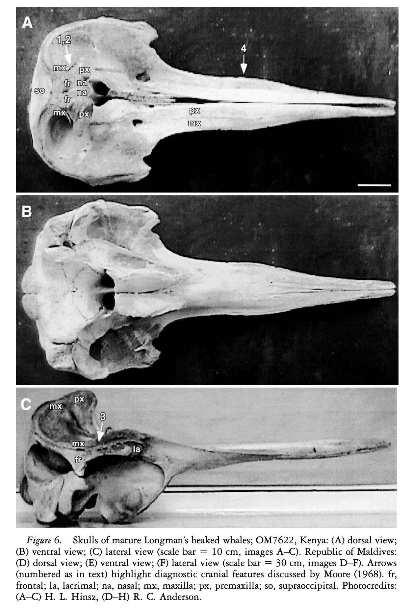

# Reference Paper: Longman’s Beaked Whale (_Indopacetus pacificus_)

This repository summarises key findings from several studies on the morphology and stranding records of Longman’s beaked whale, a rare and enigmatic cetacean species. Formerly known from only two skull specimens, Longman’s beaked whale has been classified as one of the least understood beaked whales. Studies provide critical insights into the species’ osteology, external morphology, and phylogenetics, focusing on specimens from the Indian and Pacific Oceans.

## Key Cranial Morphological Features of Longman’s Beaked Whale (_Indopacetus pacificus_)

The following four distinctive features differentiate the skull of Longman’s beaked whale from other ziphiid genera, as described by Moore (1968):

1. **Frontal Bone Prominence**

   - The frontal bones occupy an area of the vertex of the skull approximating or exceeding that of the nasal bones.

2. **Minimal Premaxillary Crest Extension**

   - There is minimal extension of the premaxillary crest between the nasal and maxillary bones, or between the frontal and maxillary bones.

3. **Deep Maxillary Groove**

   - A deep groove, approximately half the length of the orbit, is present on the dorso-lateral margin of the maxillary bone above the orbit.

4. **Rostrum Width Variation**
   - The premaxillae remain of even width along most of the rostrum length, expanding slightly at mid-length before converging towards the rostrum tip. This differs from the "pinched" appearance seen in adult males of _Mesoplodon densirostris_.

_Dalebout et al., 2003_
